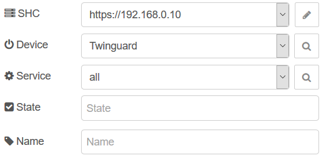
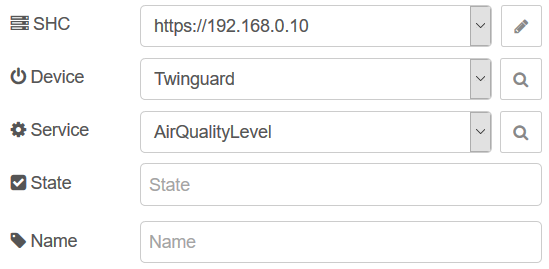
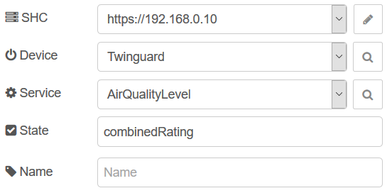

# Bosch Smart Home Controller (SHC) nodes for Node-Red

This module provides several nodes for interacting with Bosch Smart Home services and edge devices via the local controller API. A full documentation of the API can be found [here](https://apidocs.bosch-smarthome.com/local/).

### Features

- Local network discovery of the SHC
- Pairing with SHC
- Event polling (long polling)
- Get all services from devices
- Get and set states of devices
- Trigger scenarios

## Device Node

A device node sends events (which are received via long polling from the controller) as soon as any state of a device changes. 

Each device has several services. To send all the related services of a device, select a **Device** and select **all** as a **Service**. The input field **State** can be left blank.

Select a **Service** to send only objects of the specified service. As soon as any state of this service changes, the node sends an **msg** object containing the new state. No **msg** is sent from the node if the service does not exist or does not refer to the device. 

To send only a value instead of the entire service object, enter the name of the **State** in the corresponding field. No **msg** is sent from the node if the state does not exist.

To request an edge device any **msg** can be used. The node overwrites **msg.topic** and **msg.payload** with the defined state, service, or all services as array if 'all' is selected. Then it immediately sends the **msg**.

However, if the **msg.payload** matches the predefined **type** and **range** of the **service** the associated state will be updated with the specified payload value. The following services can be updated:

| Service                             | Payload Type | Payload Range | Information |
|-------------------------------------|--------------|---------------|-------------|
| **IntrusionDetectionControl**       | boolean      | true, false    | Activate/deactivate alarm system |
| **PresenceSimulationConfiguration** | boolean      | true, false    | Activate/deactivate presence simulation |
| **SmokeDetectorCheck**              | boolean      | true, false    | Triggers a test alarm on this device |
| **PowerSwitch**                     | boolean      | true, false    | Turn device on/off |
| **PrivacyMode**                     | boolean      | true, false    | Activate/deactivate camera privacy mode |
| **ClimateControl**                  | Number       | 5.0, 5.5, ..., 29.5, 30.0       | Set a room temperature |
| **ShutterControl**                  | Number       | 0.000, 0.005, ..., 0.995, 1.000 | Set the level of a shutter |

## Scenario Node

Use this node to trigger the scenario defined in this node. Each **msg** can be used as a trigger.

## Faults Node

This node sends all events containing the **faults**-key. These messages usually refer to low-battery events of battery-powered edge devices.

By activating the **Debug** check box, this node sends all messages that are received by the SHC via long polling. 
